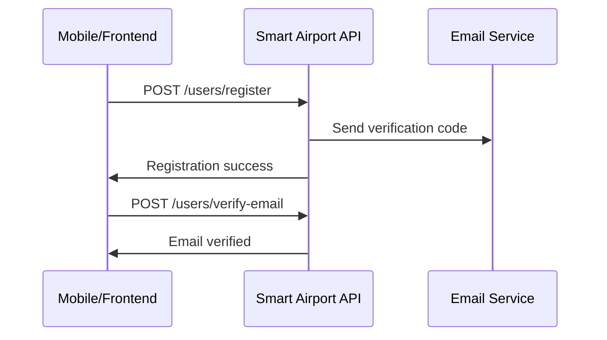
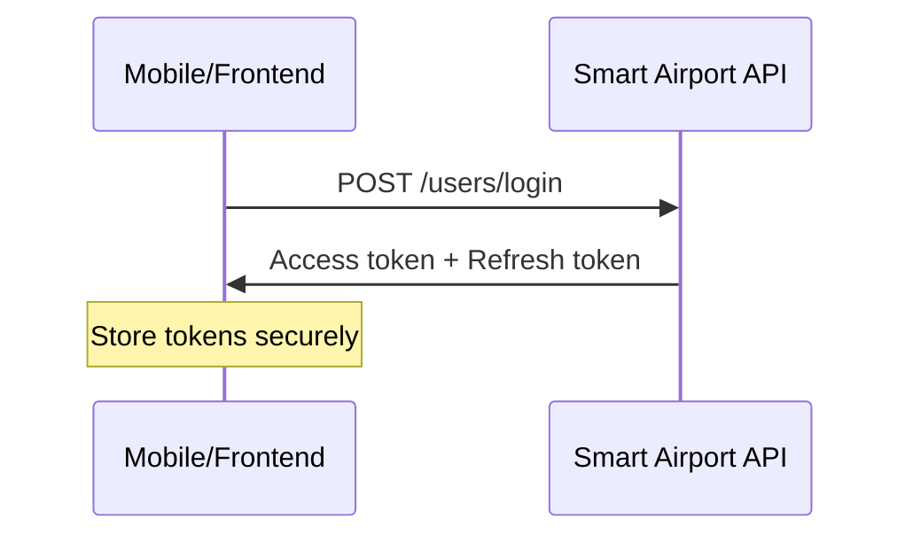
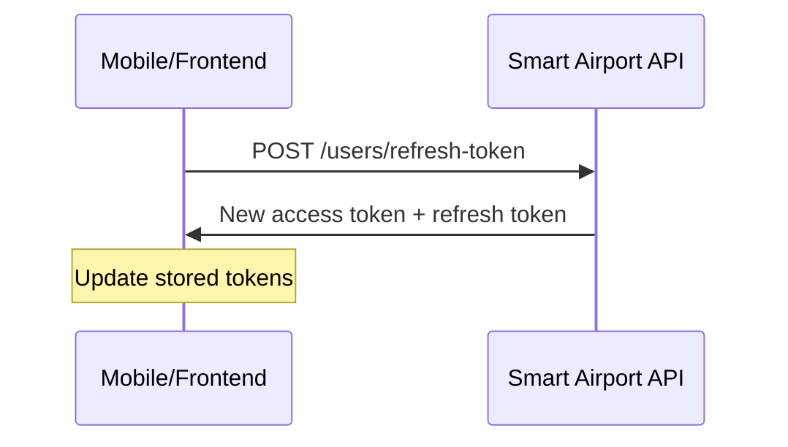
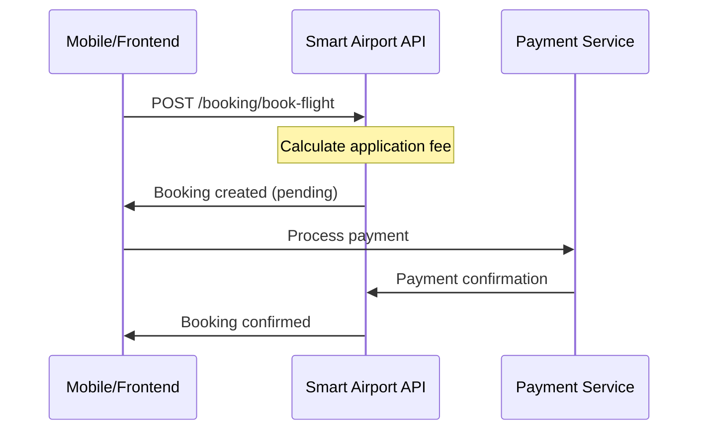

# Smart Airport API Documentation

## Overview
Welcome to the Smart Airport API documentation. This comprehensive guide provides all the information needed for mobile and frontend developers to integrate with our flight booking platform.

## Quick Start

### Base URL
```
https://your-api-domain.com
```

### Authentication
Most endpoints require JWT authentication:
```
Authorization: Bearer <access_token>
```

### Content Type
All requests should use JSON:
```
Content-Type: application/json
```

## API Modules

### 1. [User Module](./user-module-api.md)
Complete user management functionality including:
- **Authentication**: Register, login, logout, token refresh
- **Email Verification**: Verify email addresses with codes
- **Password Management**: Reset and change passwords
- **Profile Management**: Update user profiles and preferences
- **Role Management**: Admin and moderator access control

**Key Endpoints:**
- `POST /users/register` - Register new user
- `POST /users/login` - User authentication
- `GET /users/profile` - Get user profile
- `PATCH /users/profile` - Update profile

### 2. [Booking Module](./booking-module-api.md)
Flight booking operations with enhanced features:
- **Flight Booking**: Create bookings for multiple passengers
- **Passenger Management**: Handle traveler information and passport details
- **Application Fee**: Automatic fee calculation (2.5% with min/max limits)
- **Contact Details**: Separate contact information for notifications
- **Booking Status**: Track booking and payment status

**Key Endpoints:**
- `POST /booking/book-flight` - Create flight booking
- `GET /booking/my-bookings` - Get user bookings
- `GET /booking/:id` - Get booking details

## Updated Booking Requirements

### New Booking Structure
The booking system has been updated to support:

1. **Enhanced Passenger Information**
   - Traveler type classification (adult, child, infant)
   - Improved passport validation
   - Separate contact details

2. **Application Fee System**
   - Automatic 2.5% fee calculation
   - Minimum fee: $5.00
   - Maximum fee: $50.00
   - Included in total price

3. **Contact Details**
   - Separate email and phone for booking notifications
   - International phone number validation

### Example Booking Request
```json
{
  "flightID": "FL123456",
  "originAirportCode": "LGA",
  "destinationAirportCode": "DAD",
  "originCIty": "New York",
  "destinationCIty": "Da Nang",
  "departureDate": "2024-08-28",
  "arrivalDate": "2024-08-28",
  "selectedBaggageOption": {
    "type": "checked",
    "weight": "23kg",
    "price": 50,
    "currency": "USD"
  },
  "totalPrice": 1500.00,
  "currency": "USD",
  "travellersInfo": [
    {
      "firstName": "Ahmed",
      "lastName": "Mohamed",
      "birthDate": "2000-02-01",
      "travelerType": "adult",
      "nationality": "Egyptian",
      "passportNumber": "A12345678",
      "issuingCountry": "Egypt",
      "expiryDate": "2030-02-01"
    }
  ],
  "contactDetails": {
    "email": "ahmed.mohamed@example.com",
    "phone": "+201234567890"
  }
}
```

## Authentication Flow

### 1. User Registration


### 2. User Login


### 3. Token Refresh


## Booking Flow

### Complete Booking Process


## Error Handling

### Standard Error Response
```json
{
  "success": false,
  "message": "Error description",
  "error": "Error type",
  "statusCode": 400,
  "timestamp": "2025-02-27T09:05:47.193Z",
  "path": "/endpoint/path",
  "errors": {
    "field": "Validation error message"
  }
}
```

### Common HTTP Status Codes
- `200` - Success
- `201` - Created
- `400` - Bad Request (validation errors)
- `401` - Unauthorized (authentication required)
- `403` - Forbidden (insufficient permissions)
- `404` - Not Found
- `409` - Conflict (resource already exists)
- `429` - Too Many Requests (rate limited)
- `500` - Internal Server Error

## Rate Limiting
- **General endpoints**: 10 requests per minute per IP
- **Authentication endpoints**: Additional restrictions may apply

## Security Features
1. **JWT Authentication** with 15-minute access tokens
2. **Email Verification** required for booking
3. **Role-Based Access Control** (User, Moderator, Admin)
4. **Input Validation** and sanitization
5. **Rate Limiting** to prevent abuse
6. **HTTPS** encryption in production

## Development Guidelines

### Mobile/Frontend Best Practices

1. **Token Management**
   ```javascript
   // Store tokens securely
   const storeTokens = (accessToken, refreshToken) => {
     // Use secure storage (Keychain on iOS, Keystore on Android)
     secureStorage.setItem('accessToken', accessToken);
     secureStorage.setItem('refreshToken', refreshToken);
   };
   ```

2. **Automatic Token Refresh**
   ```javascript
   // Implement automatic token refresh
   const apiCall = async (endpoint, options) => {
     try {
       return await fetch(endpoint, options);
     } catch (error) {
       if (error.status === 401) {
         await refreshToken();
         return await fetch(endpoint, options);
       }
       throw error;
     }
   };
   ```

3. **Error Handling**
   ```javascript
   // Comprehensive error handling
   const handleApiError = (error) => {
     switch (error.status) {
       case 400:
         showValidationErrors(error.errors);
         break;
       case 401:
         redirectToLogin();
         break;
       case 403:
         showAccessDeniedMessage();
         break;
       default:
         showGenericError(error.message);
     }
   };
   ```

4. **Form Validation**
   ```javascript
   // Client-side validation matching server rules
   const validateBookingForm = (data) => {
     const errors = {};
     
     // Validate traveler information
     data.travellersInfo.forEach((traveler, index) => {
       if (!traveler.firstName || traveler.firstName.length < 2) {
         errors[`travellersInfo.${index}.firstName`] = 'First name required';
       }
       
       if (!traveler.passportNumber || traveler.passportNumber.length < 6) {
         errors[`travellersInfo.${index}.passportNumber`] = 'Invalid passport number';
       }
     });
     
     return errors;
   };
   ```

## Testing

### API Testing Tools
- **Postman Collection**: Available for all endpoints
- **Swagger Documentation**: Interactive API documentation at `/docs`
- **Test Environment**: Separate testing environment available

### Sample Test Data
```json
{
  "testUser": {
    "email": "test@example.com",
    "password": "TestPassword123!@",
    "firstName": "Test",
    "lastName": "User"
  },
  "testBooking": {
    "flightID": "TEST123",
    "totalPrice": 100.00,
    "currency": "USD"
  }
}
```

## Support and Resources

### Documentation Links
- [User Module API](./user-module-api.md) - Complete user management
- [Booking Module API](./booking-module-api.md) - Flight booking operations

### Contact Information
- **Technical Support**: support@smartairport.com
- **API Issues**: api-support@smartairport.com
- **Documentation**: docs@smartairport.com

### Version Information
- **API Version**: v1.0
- **Last Updated**: February 2025
- **Breaking Changes**: See changelog for details

---

*This documentation is regularly updated. Please check for the latest version before implementation.*
